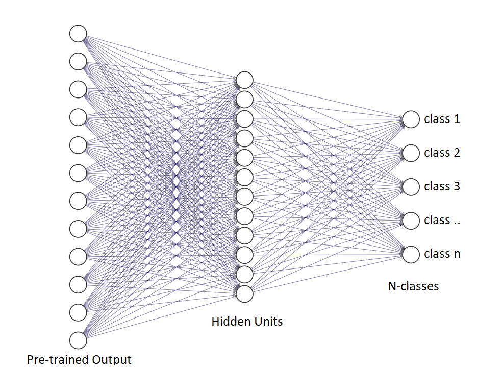

# Classification Script
This script can be used in a terminal to quickly train, test on a dataset

## Features
  - Train using pre-trained network
    - VGG16/RESNET18 
- GPU training if available
- Testing & Validation
- Adam & SGD optimizers
- Hyperparameter control: 
    - hidden units of the FCN architecture
    - learning rate
    - number of epochs
    - batch size
- Normalization pre-applied

### Fully Connected Neural Network Architecture
The network uses the output if the chosen pre-trained NN and change the final layer according to the specified parameters



## Usage
Make sure you arrange the data in the same manner below & place the .py files in the root directory:
- train
    - Class1
        - image1.jpg
        - image2.jpg
        - etc..
    - Class2
        - image1.jpg
        - etc..
- test
    - Class1
        - image1.jpg
        - image2.jpg
        - etc..
    - Class2
        - image1.jpg
        - etc..
- valid
    - Class1
        - image1.jpg
        - image2.jpg
        - etc..
    - Class2
        - image1.jpg
        - etc..
## Training

#### parameters
```
--arch resnet18/vgg16. Default: vgg16
--optim: Adam/SGD. Default: SGD
--hidden_units: the number of hidden units in the Fully Connected Layer. Default: 1024
--epochs: the number of epochs. Default: 10
--batch_size: the batch size. Default: 64
--gpu: add to train on gpu.
--save_dir: the directory in which the trained model will be saved
```
#### Sample Usage
```
python train.py --arch vgg16 --hidden_units 512 --epochs 20 --gpu
```
## Predicting
#### parameters
```
--gpu: add to predict on gpu.
--topk: show top k number of classes. Default: 5
--category_names: the path to json mapped classes if available
```
#### Sample Usage
```
python predict.py test/image1.jpg --gpu --topk 10
```
